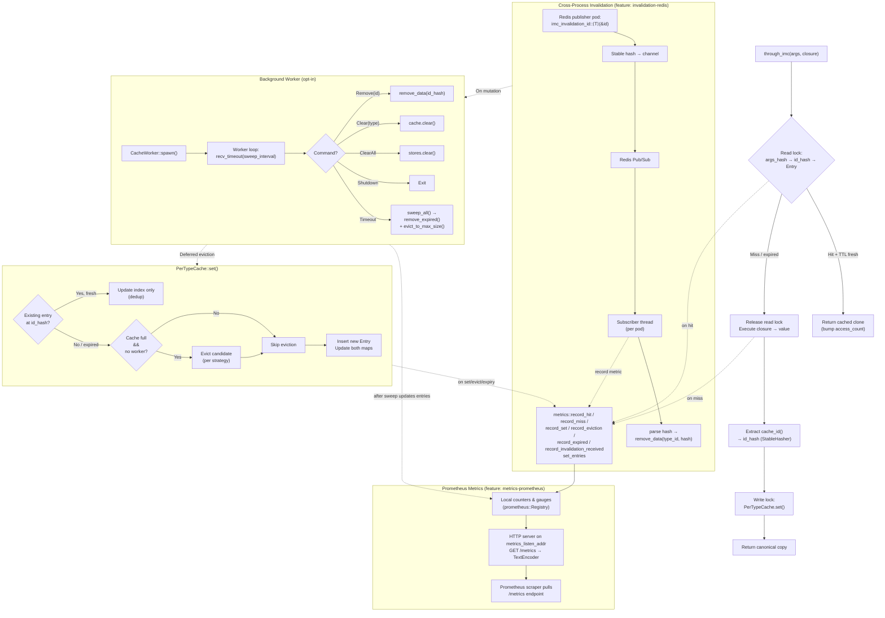

# imc — In-Memory Cache

A trait-based, deduplicating, in-memory cache for Rust. One data copy per unique identity, even when the same record is fetched through different query arguments.

```rust
let user = through_imc(user_id, || db::fetch_user(user_id));
let same = through_imc("alice@example.com", || db::fetch_user_by_email("alice@example.com"));
assert_eq!(user.id, same.id); // same backing entry
```

---

## Features

| Feature | Default | Description |
|---------|---------|-------------|
| — | always | Core caching: `through_imc`, dedup, eviction, TTL |
| `async` | no | Enables `through_imc_async` for async closure support (runtime-agnostic) |
| `tokio` | no | Implies `async` + makes `CacheWorker` use `tokio::task::spawn_blocking` instead of `std::thread` |
| `invalidation-redis` | no | Cross-process cache invalidation via Redis pub/sub (optional `redis` crate dep) |
| `critical` | no | Critical-key broadcast via Redis pub/sub. Implies `invalidation-redis`. Adds `through_critical_keyed` / `through_critical_keyed_async` and `#[derive(CriticalKey)]` |
| `logging` | no | Structured tracing events via `log_event!` macro (uses `tracing`). Format controlled by your app's subscriber |
| `metrics-prometheus` | no | Prometheus metrics (hits, misses, sets, evictions, entries) exposed via HTTP `/metrics` endpoint |

---

## Configuration

Every setting is defined **per-type** via the `ImcCacheable` trait.

### `cache_id()`
- **Purpose:** Extract the unique identity from a value after it is fetched.
- **Values:** Any `Hash + Eq + Clone + Send + 'static` type.
- **Behaviour:** Two query `args` that produce values with the same `cache_id()` share a single backing entry (dedup). A third `args` producing a different `cache_id()` creates a separate entry.

### `cache_strategy()`
- **Purpose:** Which entry to evict when the namespace is full.
- **Values:** `Lru` / `Mru` / `Lfu` / `Mfu` / `Fifo`
- **Behaviour:**

#### `Lru` — Least Recently Used
Evicts the entry whose `last_accessed` timestamp is the oldest — i.e., the one that has gone the longest without being read. Good general-purpose default for most workloads where recently accessed data is likely to be accessed again soon. Each `get()` updates the timestamp.

#### `Mru` — Most Recently Used
Evicts the entry whose `last_accessed` timestamp is the newest — i.e., the one that was just read. Useful when older data is more valuable (e.g., caches for sequential-scan or streaming workloads where the latest item is unlikely to be re-read).

#### `Lfu` — Least Frequently Used
Evicts the entry with the lowest `access_count`. Keeps frequently accessed data warm, even if it hasn't been touched recently. Each `get()` increments the counter. Good for workloads with a stable "hot set" of popular records.

#### `Mfu` — Most Frequently Used
Evicts the entry with the highest `access_count`. Makes room for fresh entries by discarding the most popular one. Useful in specialized cases where you want to force rotation of heavily accessed data.

#### `Fifo` — First In, First Out
Evicts the entry that was inserted earliest (`inserted_at`). Ignores access patterns entirely — no timestamp or counter is updated. Simple and predictable; useful when all entries are equally likely to be re-read and you just need a size cap.

### `cache_ttl()`
- **Purpose:** Time-to-live for entries in this namespace.
- **Values:** `Some(Duration)` or `None` (never expire)
- **Behaviour:** Expired entries are treated as a miss on `get()` and are replaced on the next `set()`. Stale entries are cleaned up during the background worker sweep.

### `cache_max_size()`
- **Purpose:** Maximum number of unique entries allowed.
- **Values:** Any `usize`. Default: `10_000`.
- **Behaviour:** When the namespace is at capacity and a new entry arrives, the eviction strategy selects one entry to remove. Inline eviction fires on every `set()`; when a `CacheWorker` is active, inline eviction is deferred to the periodic background sweep.

### `cache_value_size()`
- **Purpose:** Report the approximate byte-size of a value for the per-value size limit.
- **Values:** `Some(usize)` or `None` (unknown — skip size check, always cache). Default: `None`.
- **Behaviour:** When this returns a size and it exceeds [`cache_max_value_size()`](#cache_max_value_size), the value bypasses the cache entirely (returned directly to the caller without storing).

### `cache_max_value_size()`
- **Purpose:** Maximum byte-size of a single cached value.
- **Values:** Any `usize`. Default: `1_048_576` (1 MiB).
- **Behaviour:** Only takes effect when [`cache_value_size()`](#cache_value_size) is implemented and returns `Some(size)`. Values larger than this limit are not cached — the closure runs every time.

### `cache_invalidation_channel()`
- **Purpose:** Enable cross-process cache invalidation via pub/sub.
- **Values:** `Some("channel_name")` or `None` (disabled).
- **Behaviour:** When set and the `invalidation-redis` feature is enabled, the type's channel is registered with the background worker. On spawn with a Redis URL, the worker subscribes to all registered channels. A message on that channel (a stable FNV-1a hash of the `Id` as a stringified `u64`) removes the corresponding entry from every subscribing pod.

### `WorkerConfig`
- **Purpose:** Configuration for the background maintenance worker.
- **Fields:**
  - `sweep_interval: Duration` — how often the worker sweeps for expired and excess entries (default: 10s)
  - `metrics_listen_addr: Option<String>` — listen address for the Prometheus `/metrics` HTTP endpoint (e.g. `"127.0.0.1:9090"`). Requires the `metrics-prometheus` feature.
  - `redis_connection_string: Option<String>` — Redis URL for invalidation (only when `invalidation-redis` feature is enabled)
- **Behaviour:** The worker runs a single background thread that receives remove/clear/shutdown commands and periodically calls `remove_expired()` + `evict_to_max_size()` on every registered type. While the worker is active, inline eviction in `set()` is skipped to keep the hot path lock-free.

---

## Architecture Flow



---

## Prometheus Metrics

When the `metrics-prometheus` feature is enabled, imc maintains a set of counters and a gauge that track cache behaviour. An optional HTTP server exposes them as a Prometheus-scrapable `/metrics` endpoint.

### Configuration

Set `metrics_listen_addr` in `WorkerConfig` to spawn the metrics HTTP server:

```rust
let _worker = CacheWorker::spawn_with_config(WorkerConfig {
    sweep_interval: Duration::from_secs(10),
    metrics_listen_addr: Some("127.0.0.1:9090".into()),
    ..Default::default()
});
```

Prometheus scrapes the endpoint directly — no push gateway needed:

```yaml
# prometheus.yml
scrape_configs:
  - job_name: 'imc'
    static_configs:
      - targets: ['127.0.0.1:9090']
```

### Metric Reference

| Metric | Type | Labels | Description |
|--------|------|--------|-------------|
| `imc_cache_hits_total` | Counter | — | Total number of cache lookups that returned a cached value. Incremented on every successful `get()` in `PerTypeCache`. |
| `imc_cache_misses_total` | Counter | — | Total number of cache lookups that returned no value (miss or TTL expiry). Incremented when `get()` returns `None`. |
| `imc_cache_sets_total` | Counter | — | Total number of cache insertions (new entries and dedups). Incremented in `PerTypeCache::set()`. |
| `imc_cache_evictions_total` | Counter | — | Total number of entries evicted to stay within `cache_max_size()`. Incremented on inline eviction (`set()`) and background sweep eviction (`evict_to_max_size()`). |
| `imc_cache_expired_total` | Counter | — | Total number of TTL-expired entries removed. Incremented in `remove_expired()` and `clear()`. |
| `imc_cache_invalidation_received_total` | Counter | — | Total number of cross-process invalidation messages received from Redis pub/sub and processed. |
| `imc_cache_entries` | Gauge | — | Current number of unique entries across all cached types. Updated on every `imc_len()` call and after each sweep. |

### Manual Access

Encode metrics as Prometheus text format at any point:

```rust
let text = imc::metrics::encode();
println!("{text}");
```

Or start the HTTP server independently:

```rust
std::thread::spawn(|| {
    imc::metrics::serve("127.0.0.1:9090").unwrap();
});
```

---

## Lifecycle

The global cache store is lazily initialised on first use, but you can make
the lifecycle explicit at startup:

```rust
use imc::Imc;

// Option A — just ensure the store exists (no background worker):
Imc::init();

// Option B — init + spawn a background maintenance worker:
let _worker = Imc::start(Default::default());
// worker runs while _worker is alive; drop it to shut down.
```

Calling `Imc::start` is equivalent to `Imc::init()` + `CacheWorker::spawn()`.

## Module Structure

```
src/
├── lib.rs         — Public re-exports, lifecycle (Imc::init / Imc::start)
├── traits.rs      — ImcCacheable trait, CacheStrategy enum
├── hasher.rs      — StableHasher (FNV-1a), hash_value(), tick()
├── entry.rs       — Entry struct with access metadata
├── cache.rs       — PerTypeCache, GlobalCache, global()
├── worker.rs      — CacheCmd, CacheWorker, worker_loop, sweep_all
├── api.rs         — through_imc, through_imc_async, imc_remove, etc.
├── invalidation.rs— Redis pub/sub subscriber (behind invalidation-redis)
└── tests.rs       — Unit tests (>30 across all features)
```

## Quick Start

```toml
[dependencies]
imc = { git = "https://github.com/gaurav1704/rust-imc" }
```

```rust
use imc::{ImcCacheable, through_imc};
use std::time::Duration;

#[derive(Clone)]
struct User { id: u32, name: String }

impl ImcCacheable for User {
    type Id = u32;
    fn cache_id(&self) -> u32 { self.id }
    fn cache_strategy() -> CacheStrategy { CacheStrategy::Lru }
    fn cache_ttl() -> Option<Duration> { Some(Duration::from_secs(300)) }
    fn cache_max_size() -> usize { 10_000 }
}

// First call fetches; subsequent calls with same args or same id return cached.
let u: User = through_imc(42u32, || fetch_user_by_id(42));
let u2: User = through_imc("alice@example.com", || fetch_user_by_email("alice"));
assert_eq!(u.id, u2.id);
```

---

## Examples

### Diesel / PostgreSQL

Wrap Diesel queries with `through_imc` — deduplication across primary-key and alternate-key lookups works automatically.

```rust
use diesel::prelude::*;
use imc::{CacheStrategy, ImcCacheable, through_imc};
use std::time::Duration;

// ── 1.  Model (must be Clone) ──────────────────────────────────────────
#[derive(Queryable, Identifiable, Clone, Debug, PartialEq)]
#[diesel(table_name = users)]
pub struct User {
    pub id: i32,
    pub name: String,
    pub email: String,
}

// ── 2.  Cache configuration ────────────────────────────────────────────
impl ImcCacheable for User {
    type Id = i32;

    fn cache_id(&self) -> i32 { self.id }

    fn cache_strategy() -> CacheStrategy { CacheStrategy::Lru }

    fn cache_ttl() -> Option<Duration> {
        Some(Duration::from_secs(300))  // 5 minutes
    }

    fn cache_max_size() -> usize { 10_000 }
}

// ── 3.  Query helpers ──────────────────────────────────────────────────
fn get_user_by_id(conn: &mut PgConnection, id: i32) -> QueryResult<User> {
    // First call runs Diesel; second call with same id returns cached.
    Ok(through_imc(id, || users::table.find(id).first::<User>(conn)))
}

fn get_user_by_email(conn: &mut PgConnection, email: &str) -> QueryResult<User> {
    Ok(through_imc(email.to_string(), || {
        users::table.filter(users::email.eq(email)).first::<User>(conn)
    }))
}

// get_user_by_id(42) and get_user_by_email("alice@example.com") both
// resolve to User { id: 42, ... }.  The second call returns the
// cached copy — Diesel never runs.
```

Key points:
- The model must derive (or manually implement) `Clone`.
- The closure borrows `conn` — imc releases the read lock before running it, so there is no deadlock.
- Use `through_imc_async` with `diesel_async` when using async Diesel.

### Redis cross-process invalidation

Invalidate cached entries across multiple application pods when data is mutated in one of them.

```toml
[dependencies]
imc = { git = "https://github.com/gaurav1704/rust-imc", features = ["invalidation-redis"] }
redis = "0.27"
```

```rust
use imc::{CacheStrategy, ImcCacheable, CacheWorker, WorkerConfig, imc_invalidation_id};
use std::time::Duration;

// ── 1.  Model with invalidation channel ────────────────────────────────
#[derive(Clone)]
pub struct User {
    pub id: i32,
    pub name: String,
    pub email: String,
}

impl ImcCacheable for User {
    type Id = i32;

    fn cache_id(&self) -> i32 { self.id }

    fn cache_strategy() -> CacheStrategy { CacheStrategy::Lru }

    fn cache_ttl() -> Option<Duration> {
        Some(Duration::from_secs(300))
    }

    fn cache_max_size() -> usize { 10_000 }

    // All pods that cache User subscribe to this channel.
    fn cache_invalidation_channel() -> Option<&'static str> {
        Some("users")
    }
}

// ── 2.  Spawn worker + Redis subscriber on every pod ───────────────────
let _worker = CacheWorker::spawn_with_config(WorkerConfig {
    sweep_interval: Duration::from_secs(10),
    redis_connection_string: Some("redis://localhost:6379".into()),
});

// ── 3.  On mutation, publish the stable hash to invalidate ─────────────
// (runs in the pod that performed the INSERT/UPDATE/DELETE)
fn publish_invalidation(user_id: i32) {
    let client = redis::Client::open("redis://localhost:6379").unwrap();
    let mut conn = client.get_connection().unwrap();
    let hash: String = imc_invalidation_id::<User>(&user_id);
    let _: () = redis::Cmd::publish("users", hash).query(&mut conn).unwrap();
}

// After publish_invalidation(42), every pod that subscribes to the
// "users" channel removes User { id: 42 } from its local cache.
// The next read re-fetches from the database.
```

Key points:
- Every pod runs the subscriber (via `CacheWorker::spawn_with_config` with a `redis_connection_string`).
- Only the mutating pod needs to call `publish_invalidation` — imc does not auto-publish.
- The hash is computed with the same FNV-1a `StableHasher` on every pod, so all pods agree on which entry to remove.
- Subscribers automatically reconnect on error with a 5-second backoff.

### Multi-condition queries & cached result sets

Tuple args let you cache queries with multiple WHERE clauses. Combined with the `Vec<T>` blanket impl, entire filtered result sets are cached and deduplicated.

```rust
use imc::{CacheStrategy, ImcCacheable, through_imc};
use std::time::Duration;

// ── 1.  A domain type ──────────────────────────────────────────────────
#[derive(Clone, Debug)]
pub struct User {
    pub id: i32,
    pub name: String,
    pub region: String,
    pub age: i32,
}

impl ImcCacheable for User {
    type Id = i32;
    fn cache_id(&self) -> i32 { self.id }
    fn cache_strategy() -> CacheStrategy { CacheStrategy::Lru }
    fn cache_ttl() -> Option<Duration> { Some(Duration::from_secs(120)) }
    fn cache_max_size() -> usize { 5_000 }
}

// ── 2.  Single-row query with two conditions ───────────────────────────
// The args tuple (age, region) becomes the cache key.
// A second call with the same pair hits the cache.
fn get_users_by_age_and_region(age: i32, region: &str) -> User {
    through_imc((age, region.to_string()), || {
        // e.g. SELECT * FROM users WHERE age > $1 AND region = $2
        fetch_user_raw(age, region)
    })
}

// ── 3.  Result set (Vec) with operator-aware conditions ────────────────
// The comparison operator is part of the cache key — `age > 10` and
// `age < 10` produce different tuples and never collide.
// Vec<User> implements ImcCacheable automatically — cache_id() hashes
// all element IDs together.  Two different queries that return the same
// logical set of users share one cached Vec.
fn get_all_users_by_age_and_region(op: &str, age: i32, region: &str) -> Vec<User> {
    through_imc(("list", op.to_string(), age, region.to_string()), || {
        // e.g. SELECT * FROM users WHERE age > $1 AND region = $2
        //     op = "gt" or "lt" or "gte" …
        fetch_users_raw(op, age, region)
    })
}

// ── 4.  Mix and match ──────────────────────────────────────────────────
// Tuples with different shapes are distinct cache keys:
let _ = get_users_by_age_and_region(10, "india");     // key: (10, "india")
let _ = get_all_users_by_age_and_region("gt", 10, "india"); // key: ("list", "gt", 10, "india")
```

Any tuple of `Hash + Clone + Send + 'static` values works as the cache key: `(i32, String)`, `(bool, u64, String)`, etc. The `Vec<T>` blanket means you never need a wrapper type for result sets.

### Per-value size limit

Prevent large values from wasting cache capacity by implementing `cache_value_size()`:

```rust
impl ImcCacheable for User {
    // …
    fn cache_value_size(&self) -> Option<usize> {
        Some(std::mem::size_of::<i32>() * 3 + self.name.len() + self.region.len())
    }
    fn cache_max_value_size() -> usize { 65_536 } // 64 KiB
}

// Values larger than 64 KiB bypass the cache entirely:
let big = through_imc("large_blob", || fetch_huge_user()); // never stored
```

### Typed cache keys

By default `through_imc` accepts any `Hash + Clone + Send + 'static` value as a key — flexible, but a typo in a string key silently creates a different cache entry. Override the `Key` associated type on `ImcCacheable` with a closed enum to make invalid keys a compile-time error:

```rust
use imc::{CacheStrategy, ImcCacheable, through_imc_keyed};

#[derive(Hash, Clone)]
enum UserKey { ById(i32), ByEmail(String) }

impl ImcCacheable for User {
    type Id = i32;
    type Key = UserKey;
    // … other trait methods unchanged
}

// Compiler-enforced keys:
through_imc_keyed(UserKey::ById(42), || fetch_user_by_id(42));
through_imc_keyed(UserKey::ByEmail("alice@example.com".into()), || fetch_user_by_email("alice@example.com"));

// through_imc_keyed("anything", || …); // ✗ compile error — wrong type
```

The original `through_imc` (free-form key) and `through_imc_keyed` (typed key) coexist — use whichever fits your call site. Async equivalents `through_imc_async` / `through_imc_keyed_async` are available under the `async` or `tokio` features.

### Critical keys (cross-pod broadcast)

Enable the `critical` feature and derive `CriticalKey` on your key enum to automatically broadcast invalidation messages whenever `through_critical_keyed` stores a new value. Other pods subscribed to the same Redis channel will evict their stale copy.

```rust
use imc::{CacheStrategy, ImcCacheable, through_critical_keyed, CriticalKey};
use imc_derive::CriticalKey;

#[derive(Hash, Clone, CriticalKey)]
enum UserKey { ById(i32), ByEmail(String) }

impl ImcCacheable for User {
    type Id = i32;
    type Key = UserKey;
    // … other trait methods unchanged
}

// ── Pod A caches a user ─────────────────────────────────────────
let u = through_critical_keyed(UserKey::ByEmail("alice@example.com".into()), || {
    fetch_user_from_db("alice@example.com")
});

// ── Pod B updates the same user and calls through_critical_keyed ─
// The key hash is published on the "UserKey" channel.
// Pod A's subscriber receives it and evicts the stale entry.
let u = through_critical_keyed(UserKey::ByEmail("alice@example.com".into()), || {
    fetch_user_from_db("alice@example.com")  // fresh from DB
});
```

**How it works:**
- The derive macro implements `CriticalKey` for the enum, providing a channel name derived from `module_path!() + "::" + type_name`.
- `through_critical_keyed` behaves exactly like `through_imc_keyed` but additionally registers the channel and publishes the key hash after storing.
- `CacheWorker::spawn_with_config` automatically starts a Redis subscriber thread when `redis_connection_string` is set and the `critical` feature is enabled.
- On receiving a message, the subscriber removes the cache entry by its key hash. The next read fetches fresh data.

Note: The regular `through_imc_keyed` does **not** broadcast — use `through_critical_keyed` (or `through_critical_keyed_async`) when you need cross-pod cache coherency.
