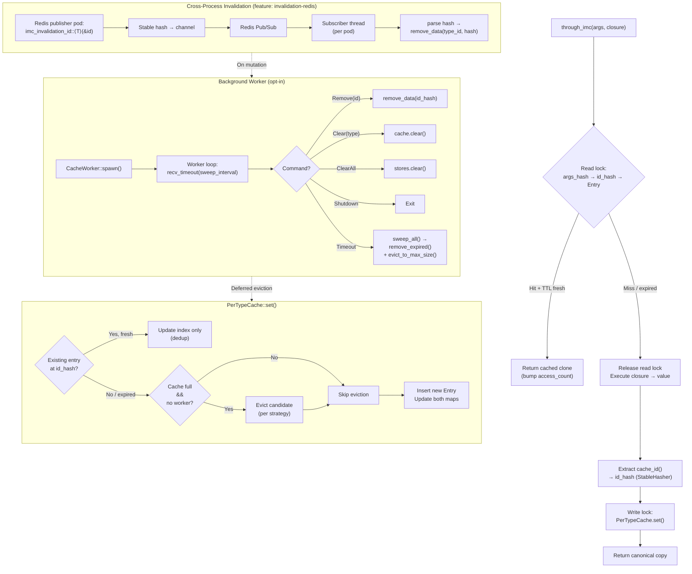

# imc — In-Memory Cache

A trait-based, deduplicating, in-memory cache for Rust. One data copy per unique identity, even when the same record is fetched through different query arguments.

```rust
let user = through_imc(user_id, || db::fetch_user(user_id));
let same = through_imc("alice@example.com", || db::fetch_user_by_email("alice@example.com"));
assert_eq!(user.id, same.id); // same backing entry
```

---

## Features

| Feature | Default | Description |
|---------|---------|-------------|
| — | always | Core caching: `through_imc`, `through_imc_async`, dedup, eviction, TTL |
| `invalidation-redis` | no | Cross-process cache invalidation via Redis pub/sub (optional `redis` crate dep) |

---

## Configuration

Every setting is defined **per-type** via the `ImcCacheable` trait.

### `cache_id()`
- **Purpose:** Extract the unique identity from a value after it is fetched.
- **Values:** Any `Hash + Eq + Clone + Send + 'static` type.
- **Behaviour:** Two query `args` that produce values with the same `cache_id()` share a single backing entry (dedup). A third `args` producing a different `cache_id()` creates a separate entry.

### `cache_strategy()`
- **Purpose:** Which entry to evict when the namespace is full.
- **Values:** `Lru` / `Mru` / `Lfu` / `Mfu` / `Fifo`
- **Behaviour:**

| Strategy | Evicts … | Ordered by |
|----------|----------|------------|
| `Lru` | Least Recently Used | `last_accessed` timestamp |
| `Mru` | Most Recently Used | `last_accessed` timestamp |
| `Lfu` | Least Frequently Used | `access_count` |
| `Mfu` | Most Frequently Used | `access_count` |
| `Fifo` | Earliest inserted | `inserted_at` timestamp |

### `cache_ttl()`
- **Purpose:** Time-to-live for entries in this namespace.
- **Values:** `Some(Duration)` or `None` (never expire)
- **Behaviour:** Expired entries are treated as a miss on `get()` and are replaced on the next `set()`. Stale entries are cleaned up during the background worker sweep.

### `cache_max_size()`
- **Purpose:** Maximum number of unique entries allowed.
- **Values:** Any `usize`. Default: `10_000`.
- **Behaviour:** When the namespace is at capacity and a new entry arrives, the eviction strategy selects one entry to remove. Inline eviction fires on every `set()`; when a `CacheWorker` is active, inline eviction is deferred to the periodic background sweep.

### `cache_invalidation_channel()`
- **Purpose:** Enable cross-process cache invalidation via pub/sub.
- **Values:** `Some("channel_name")` or `None` (disabled).
- **Behaviour:** When set and the `invalidation-redis` feature is enabled, the type's channel is registered with the background worker. On spawn with a Redis URL, the worker subscribes to all registered channels. A message on that channel (a stable FNV-1a hash of the `Id` as a stringified `u64`) removes the corresponding entry from every subscribing pod.

### `WorkerConfig`
- **Purpose:** Configuration for the background maintenance worker.
- **Fields:**
  - `sweep_interval: Duration` — how often the worker sweeps for expired and excess entries (default: 10s)
  - `redis_connection_string: Option<String>` — Redis URL for invalidation (only when `invalidation-redis` feature is enabled)
- **Behaviour:** The worker runs a single background thread that receives remove/clear/shutdown commands and periodically calls `remove_expired()` + `evict_to_max_size()` on every registered type. While the worker is active, inline eviction in `set()` is skipped to keep the hot path lock-free.

---

## Architecture Flow



---

## Quick Start

```toml
[dependencies]
imc = { git = "https://github.com/gaurav1704/rust-imc" }
```

```rust
use imc::{ImcCacheable, through_imc};
use std::time::Duration;

#[derive(Clone)]
struct User { id: u32, name: String }

impl ImcCacheable for User {
    type Id = u32;
    fn cache_id(&self) -> u32 { self.id }
    fn cache_strategy() -> CacheStrategy { CacheStrategy::Lru }
    fn cache_ttl() -> Option<Duration> { Some(Duration::from_secs(300)) }
    fn cache_max_size() -> usize { 10_000 }
}

// First call fetches; subsequent calls with same args or same id return cached.
let u: User = through_imc(42u32, || fetch_user_by_id(42));
let u2: User = through_imc("alice@example.com", || fetch_user_by_email("alice"));
assert_eq!(u.id, u2.id);
```

### With background worker + Redis invalidation

```toml
[dependencies]
imc = { git = "https://github.com/gaurav1704/rust-imc", features = ["invalidation-redis"] }
```

```rust
use imc::{CacheWorker, WorkerConfig};

// Spawn once at startup
let _worker = CacheWorker::spawn_with_config(WorkerConfig {
    sweep_interval: Duration::from_secs(10),
    redis_connection_string: Some("redis://localhost:6379".into()),
});

// On data mutation, publish the stable hash:
redis_publish("user_channel", imc_invalidation_id::<User>(&42)).await;
```
