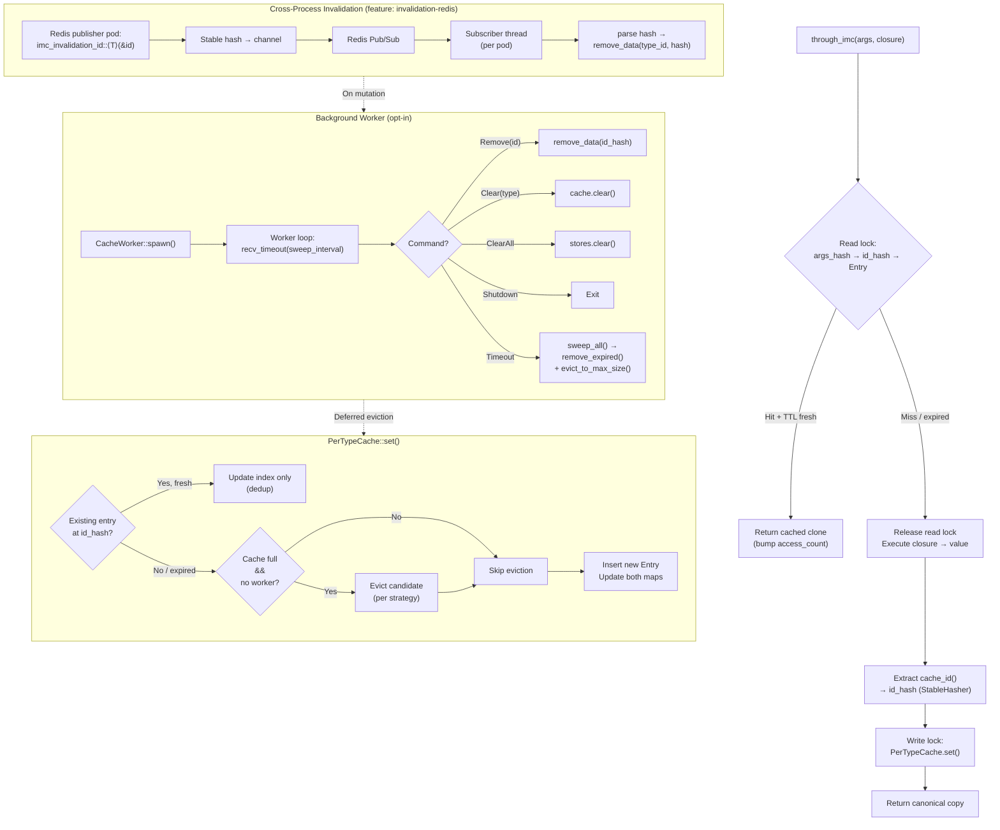

# imc — In-Memory Cache

A trait-based, deduplicating, in-memory cache for Rust. One data copy per unique identity, even when the same record is fetched through different query arguments.

```rust
let user = through_imc(user_id, || db::fetch_user(user_id));
let same = through_imc("alice@example.com", || db::fetch_user_by_email("alice@example.com"));
assert_eq!(user.id, same.id); // same backing entry
```

---

## Features

| Feature | Default | Description |
|---------|---------|-------------|
| — | always | Core caching: `through_imc`, dedup, eviction, TTL |
| `async` | no | Enables `through_imc_async` for async closure support (runtime-agnostic) |
| `tokio` | no | Implies `async` + makes `CacheWorker` use `tokio::task::spawn_blocking` instead of `std::thread` |
| `invalidation-redis` | no | Cross-process cache invalidation via Redis pub/sub (optional `redis` crate dep) |
| `logging` | no | Structured tracing events via `log_event!` macro (uses `tracing`). Format controlled by your app's subscriber |
| `metrics-prometheus` | no | Prometheus metrics (hits, misses, sets, evictions, entries) pushed to a Push Gateway via `metrics::push()` |

---

## Configuration

Every setting is defined **per-type** via the `ImcCacheable` trait.

### `cache_id()`
- **Purpose:** Extract the unique identity from a value after it is fetched.
- **Values:** Any `Hash + Eq + Clone + Send + 'static` type.
- **Behaviour:** Two query `args` that produce values with the same `cache_id()` share a single backing entry (dedup). A third `args` producing a different `cache_id()` creates a separate entry.

### `cache_strategy()`
- **Purpose:** Which entry to evict when the namespace is full.
- **Values:** `Lru` / `Mru` / `Lfu` / `Mfu` / `Fifo`
- **Behaviour:**

| Strategy | Evicts … | Ordered by |
|----------|----------|------------|
| `Lru` | Least Recently Used | `last_accessed` timestamp |
| `Mru` | Most Recently Used | `last_accessed` timestamp |
| `Lfu` | Least Frequently Used | `access_count` |
| `Mfu` | Most Frequently Used | `access_count` |
| `Fifo` | Earliest inserted | `inserted_at` timestamp |

### `cache_ttl()`
- **Purpose:** Time-to-live for entries in this namespace.
- **Values:** `Some(Duration)` or `None` (never expire)
- **Behaviour:** Expired entries are treated as a miss on `get()` and are replaced on the next `set()`. Stale entries are cleaned up during the background worker sweep.

### `cache_max_size()`
- **Purpose:** Maximum number of unique entries allowed.
- **Values:** Any `usize`. Default: `10_000`.
- **Behaviour:** When the namespace is at capacity and a new entry arrives, the eviction strategy selects one entry to remove. Inline eviction fires on every `set()`; when a `CacheWorker` is active, inline eviction is deferred to the periodic background sweep.

### `cache_invalidation_channel()`
- **Purpose:** Enable cross-process cache invalidation via pub/sub.
- **Values:** `Some("channel_name")` or `None` (disabled).
- **Behaviour:** When set and the `invalidation-redis` feature is enabled, the type's channel is registered with the background worker. On spawn with a Redis URL, the worker subscribes to all registered channels. A message on that channel (a stable FNV-1a hash of the `Id` as a stringified `u64`) removes the corresponding entry from every subscribing pod.

### `WorkerConfig`
- **Purpose:** Configuration for the background maintenance worker.
- **Fields:**
  - `sweep_interval: Duration` — how often the worker sweeps for expired and excess entries (default: 10s)
  - `redis_connection_string: Option<String>` — Redis URL for invalidation (only when `invalidation-redis` feature is enabled)
- **Behaviour:** The worker runs a single background thread that receives remove/clear/shutdown commands and periodically calls `remove_expired()` + `evict_to_max_size()` on every registered type. While the worker is active, inline eviction in `set()` is skipped to keep the hot path lock-free.

---

## Architecture Flow



---

## Lifecycle

The global cache store is lazily initialised on first use, but you can make
the lifecycle explicit at startup:

```rust
use imc::Imc;

// Option A — just ensure the store exists (no background worker):
Imc::init();

// Option B — init + spawn a background maintenance worker:
let _worker = Imc::start(Default::default());
// worker runs while _worker is alive; drop it to shut down.
```

Calling `Imc::start` is equivalent to `Imc::init()` + `CacheWorker::spawn()`.

## Module Structure

```
src/
├── lib.rs         — Public re-exports, lifecycle (Imc::init / Imc::start)
├── traits.rs      — ImcCacheable trait, CacheStrategy enum
├── hasher.rs      — StableHasher (FNV-1a), hash_value(), tick()
├── entry.rs       — Entry struct with access metadata
├── cache.rs       — PerTypeCache, GlobalCache, global()
├── worker.rs      — CacheCmd, CacheWorker, worker_loop, sweep_all
├── api.rs         — through_imc, through_imc_async, imc_remove, etc.
├── invalidation.rs— Redis pub/sub subscriber (behind invalidation-redis)
└── tests.rs       — Unit tests (>30 across all features)
```

## Quick Start

```toml
[dependencies]
imc = { git = "https://github.com/gaurav1704/rust-imc" }
```

```rust
use imc::{ImcCacheable, through_imc};
use std::time::Duration;

#[derive(Clone)]
struct User { id: u32, name: String }

impl ImcCacheable for User {
    type Id = u32;
    fn cache_id(&self) -> u32 { self.id }
    fn cache_strategy() -> CacheStrategy { CacheStrategy::Lru }
    fn cache_ttl() -> Option<Duration> { Some(Duration::from_secs(300)) }
    fn cache_max_size() -> usize { 10_000 }
}

// First call fetches; subsequent calls with same args or same id return cached.
let u: User = through_imc(42u32, || fetch_user_by_id(42));
let u2: User = through_imc("alice@example.com", || fetch_user_by_email("alice"));
assert_eq!(u.id, u2.id);
```

---

## Examples

### Diesel / PostgreSQL

Wrap Diesel queries with `through_imc` — deduplication across primary-key and alternate-key lookups works automatically.

```rust
use diesel::prelude::*;
use imc::{CacheStrategy, ImcCacheable, through_imc};
use std::time::Duration;

// ── 1.  Model (must be Clone) ──────────────────────────────────────────
#[derive(Queryable, Identifiable, Clone, Debug, PartialEq)]
#[diesel(table_name = users)]
pub struct User {
    pub id: i32,
    pub name: String,
    pub email: String,
}

// ── 2.  Cache configuration ────────────────────────────────────────────
impl ImcCacheable for User {
    type Id = i32;

    fn cache_id(&self) -> i32 { self.id }

    fn cache_strategy() -> CacheStrategy { CacheStrategy::Lru }

    fn cache_ttl() -> Option<Duration> {
        Some(Duration::from_secs(300))  // 5 minutes
    }

    fn cache_max_size() -> usize { 10_000 }
}

// ── 3.  Query helpers ──────────────────────────────────────────────────
fn get_user_by_id(conn: &mut PgConnection, id: i32) -> QueryResult<User> {
    // First call runs Diesel; second call with same id returns cached.
    Ok(through_imc(id, || users::table.find(id).first::<User>(conn)))
}

fn get_user_by_email(conn: &mut PgConnection, email: &str) -> QueryResult<User> {
    Ok(through_imc(email.to_string(), || {
        users::table.filter(users::email.eq(email)).first::<User>(conn)
    }))
}

// get_user_by_id(42) and get_user_by_email("alice@example.com") both
// resolve to User { id: 42, ... }.  The second call returns the
// cached copy — Diesel never runs.
```

Key points:
- The model must derive (or manually implement) `Clone`.
- The closure borrows `conn` — imc releases the read lock before running it, so there is no deadlock.
- Use `through_imc_async` with `diesel_async` when using async Diesel.

### Redis cross-process invalidation

Invalidate cached entries across multiple application pods when data is mutated in one of them.

```toml
[dependencies]
imc = { git = "https://github.com/gaurav1704/rust-imc", features = ["invalidation-redis"] }
redis = "0.27"
```

```rust
use imc::{CacheStrategy, ImcCacheable, CacheWorker, WorkerConfig, imc_invalidation_id};
use std::time::Duration;

// ── 1.  Model with invalidation channel ────────────────────────────────
#[derive(Clone)]
pub struct User {
    pub id: i32,
    pub name: String,
    pub email: String,
}

impl ImcCacheable for User {
    type Id = i32;

    fn cache_id(&self) -> i32 { self.id }

    fn cache_strategy() -> CacheStrategy { CacheStrategy::Lru }

    fn cache_ttl() -> Option<Duration> {
        Some(Duration::from_secs(300))
    }

    fn cache_max_size() -> usize { 10_000 }

    // All pods that cache User subscribe to this channel.
    fn cache_invalidation_channel() -> Option<&'static str> {
        Some("users")
    }
}

// ── 2.  Spawn worker + Redis subscriber on every pod ───────────────────
let _worker = CacheWorker::spawn_with_config(WorkerConfig {
    sweep_interval: Duration::from_secs(10),
    redis_connection_string: Some("redis://localhost:6379".into()),
});

// ── 3.  On mutation, publish the stable hash to invalidate ─────────────
// (runs in the pod that performed the INSERT/UPDATE/DELETE)
fn publish_invalidation(user_id: i32) {
    let client = redis::Client::open("redis://localhost:6379").unwrap();
    let mut conn = client.get_connection().unwrap();
    let hash: String = imc_invalidation_id::<User>(&user_id);
    let _: () = redis::Cmd::publish("users", hash).query(&mut conn).unwrap();
}

// After publish_invalidation(42), every pod that subscribes to the
// "users" channel removes User { id: 42 } from its local cache.
// The next read re-fetches from the database.
```

Key points:
- Every pod runs the subscriber (via `CacheWorker::spawn_with_config` with a `redis_connection_string`).
- Only the mutating pod needs to call `publish_invalidation` — imc does not auto-publish.
- The hash is computed with the same FNV-1a `StableHasher` on every pod, so all pods agree on which entry to remove.
- Subscribers automatically reconnect on error with a 5-second backoff.
