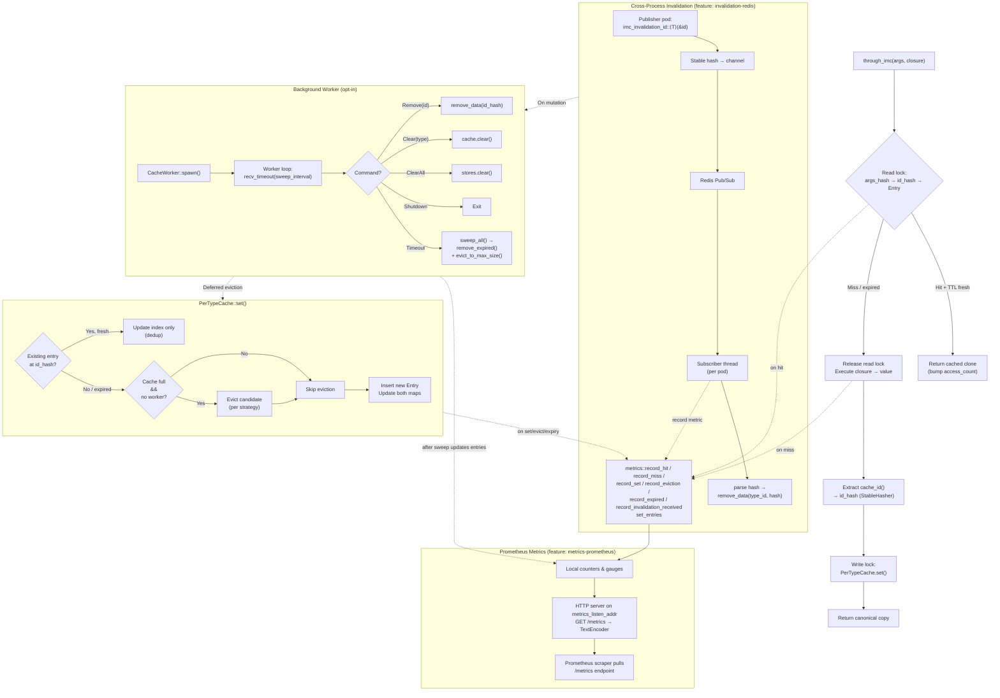

# imc — In-Memory Cache

A trait-based, deduplicating, in-memory cache. One data copy per unique identity, even when the same record is fetched through different query arguments.

```rust
let user = through_imc(user_id, || db::fetch_user(user_id));
let same = through_imc("alice@example.com", || db::fetch_user_by_email("alice@example.com"));
assert_eq!(user.id, same.id); // same backing entry
```

---

## Quick Start

```toml
[dependencies]
imc = { git = "https://github.com/gaurav1704/rust-imc" }
```

```rust
use imc::{ImcCacheable, CacheStrategy, through_imc};
use std::time::Duration;

// ── 1.  Define your type and configure caching ────────────────────────
#[derive(Clone)]
struct User { id: u32, name: String }

impl ImcCacheable for User {
    type Id = u32;
    type Key = String;

    fn cache_id(&self) -> u32 { self.id }

    fn cache_strategy() -> CacheStrategy { CacheStrategy::Lru }
    fn cache_ttl() -> Option<Duration> { Some(Duration::from_secs(300)) }
    fn cache_max_size() -> usize { 10_000 }
}

// ── 2.  Wrap expensive operations ─────────────────────────────────────
let u: User = through_imc(42u32, || fetch_user_by_id(42));
let u2: User = through_imc("alice@example.com", || fetch_user_by_email("alice"));
assert_eq!(u.id, u2.id); // one backing entry
```

---

## Core API

### `CacheStrategy` (enum)

| Variant | Eviction rule |
|---------|---------------|
| `Lru` | Least Recently Used — evicts the entry with the oldest `last_accessed` timestamp |
| `Mru` | Most Recently Used — evicts the entry with the newest `last_accessed` timestamp |
| `Lfu` | Least Frequently Used — evicts the entry with the lowest `access_count` |
| `Mfu` | Most Frequently Used — evicts the entry with the highest `access_count` |
| `Fifo` | First In, First Out — evicts the entry with the earliest `inserted_at` |

### `ImcCacheable` (trait)

Every cacheable type must implement this trait. You must define:

| Item | Type / Signature | Required? |
|------|------------------|-----------|
| `type Id` | `Hash + Eq + Clone + Send + 'static` | **yes** |
| `type Key` | `Hash + Clone + Send + 'static` | **yes** |
| `fn cache_id(&self) -> Self::Id` | — | **yes** |
| `fn cache_strategy() -> CacheStrategy` | — | no (default: `Lru`) |
| `fn cache_ttl() -> Option<Duration>` | — | no (default: `None`) |
| `fn cache_max_size() -> usize` | — | no (default: `10_000`) |
| `fn cache_value_size() -> Option<usize>` | — | no (default: `None`) |
| `fn cache_max_value_size() -> usize` | — | no (default: `1_048_576`) |
| `fn cache_invalidation_channel() -> Option<&'static str>` | — | no (default: `None`) |

```rust
use imc::{ImcCacheable, CacheStrategy};
use std::time::Duration;

#[derive(Clone)]
struct User { id: u32, name: String }

impl ImcCacheable for User {
    type Id = u32;
    type Key = String;

    fn cache_id(&self) -> u32 { self.id }

    // ── Optional trait methods ────────────────────────────────────
    fn cache_strategy() -> CacheStrategy { CacheStrategy::Lru }
    fn cache_ttl() -> Option<Duration> { Some(Duration::from_secs(300)) }
    fn cache_max_size() -> usize { 10_000 }

    /// Per-value size check — values larger than this bypass the cache.
    fn cache_value_size(&self) -> Option<usize> {
        Some(std::mem::size_of::<u32>() + self.name.len())
    }
    fn cache_max_value_size() -> usize { 65_536 } // 64 KiB

    /// Cross-process invalidation channel (requires `invalidation-redis`).
    fn cache_invalidation_channel() -> Option<&'static str> { None }
}
```

### `CriticalKey` (trait, requires `critical` feature)

Marker trait for key enums that should broadcast invalidation messages whenever [`through_imc_keyed`] stores a fresh value. Derive it — never implement manually:

```rust
use imc_derive::CriticalKey;

#[derive(Hash, Clone, CriticalKey)]
enum UserKey { ById(i32), ByEmail(String) }
```

When the `critical` feature is enabled, `through_imc_keyed` requires `T::Key: CriticalKey` — you **must** derive `CriticalKey` on every key enum.

### Functions

#### `through_imc(args, || value)` / `through_imc_async(args, || async { value })`

Cache with a free-form key (any `Hash + Clone + Send + 'static`). Two calls that produce the same identity share one entry:

```rust
let u: User = through_imc(42u32, || fetch_user(42));
let same: User = through_imc("admin@example.com", || fetch_user_by_email("admin"));
assert_eq!(u.id, same.id);
```

Async variant (requires `async` or `tokio` feature):

```rust
let u: User = through_imc_async(42u32, || async { fetch_user(42).await }).await;
```

#### `through_imc_keyed(key, || value)` / `through_imc_keyed_async(key, || async { value })`

Same as `through_imc` but with a compiler-enforced key type:

```rust
#[derive(Hash, Clone)]
enum UserKey { ById(i32), ByEmail(String) }

impl ImcCacheable for User {
    type Id = i32;
    type Key = UserKey;
    // …
}

through_imc_keyed(UserKey::ById(42), || fetch_user_by_id(42));
// through_imc_keyed("anything", || …); // ✗ compile error
```

When the `critical` feature is enabled, broadcast is automatic (see [Critical keys](#critical-keys-cross-pod-broadcast)).

#### `imc_remove::<T>(&id)`

Remove a single entry by its identity:

```rust
imc_remove::<User>(&42);
```

#### `imc_clear::<T>()`

Evict every cached entry for type `T`:

```rust
imc_clear::<User>();
```

#### `imc_len::<T>() -> usize`

Number of unique entries currently cached for type `T`.

#### `imc_invalidation_id::<T>(&id) -> String`

Compute the stable hash string for cross-process invalidation (see [Redis cross-process invalidation](#redis-cross-process-invalidation)).

### Macros

#### `log_event!`

```rust
log_event!(INFO, CACHE, HIT, "cache hit for args_hash={}", args_hash);
log_event!(DEBUG, CACHE, EVICT, id_hash = id_hash);
log_event!(WARN, CACHE, SET, "value too large, skipping");
```

Requires the `logging` feature. Expands to nothing at compile time when the feature is off.

---

## Feature Flags

| Feature | Default | Description |
|---------|---------|-------------|
| — | always | Core caching: `through_imc`, dedup, eviction, TTL |
| `async` | no | Enables `through_imc_async` / `through_imc_keyed_async` (runtime-agnostic) |
| `tokio` | no | Implies `async` + makes `CacheWorker` use `tokio::task::spawn_blocking` |
| `invalidation-redis` | no | Cross-process cache invalidation via Redis pub/sub |
| `critical` | no | Critical-key broadcast via Redis pub/sub. Implies `invalidation-redis`. Requires `#[derive(CriticalKey)]` on key enums used with `through_imc_keyed` |
| `logging` | no | Structured tracing events via `log_event!` macro |
| `metrics-prometheus` | no | Prometheus counters / gauges + HTTP `/metrics` endpoint |

---

## Advanced Usage

### Lifecycle

The global cache store initialises lazily on first use. For explicit control:

```rust
use imc::Imc;

// Option A — just ensure the store exists (no background worker):
Imc::init();

// Option B — init + spawn a background maintenance worker:
let _worker = Imc::start(Default::default());
```

`Imc::start` is equivalent to `Imc::init()` + `CacheWorker::spawn()`.

### Worker / Background Maintenance

```rust
use imc::{CacheWorker, WorkerConfig};
use std::time::Duration;

let _worker = CacheWorker::spawn_with_config(WorkerConfig {
    sweep_interval: Duration::from_secs(10),
    #[cfg(feature = "metrics-prometheus")]
    metrics_listen_addr: Some("127.0.0.1:9090".into()),
    #[cfg(feature = "invalidation-redis")]
    redis_connection_string: Some("redis://localhost:6379".into()),
});
```

While the worker is alive, inline eviction at `set()` is deferred to the periodic background sweep, keeping the hot path lock-free.

### Redis cross-process invalidation

**Requires:** `invalidation-redis` feature.

```toml
[dependencies]
imc = { git = "https://github.com/gaurav1704/rust-imc", features = ["invalidation-redis"] }
redis = "0.27"
```

```rust
use imc::{ImcCacheable, CacheStrategy, CacheWorker, WorkerConfig, imc_invalidation_id};
use std::time::Duration;

// ── 1.  Configure invalidation channel on your type ────────────────────
impl ImcCacheable for User {
    // … type Id, cache_id, etc.
    fn cache_invalidation_channel() -> Option<&'static str> { Some("users") }
}

// ── 2.  Spawn worker + subscriber on every pod ─────────────────────────
let _worker = CacheWorker::spawn_with_config(WorkerConfig {
    sweep_interval: Duration::from_secs(10),
    redis_connection_string: Some("redis://localhost:6379".into()),
    ..Default::default()
});

// ── 3.  On mutation, publish the stable hash ───────────────────────────
fn on_user_updated(user_id: i32) {
    let client = redis::Client::open("redis://localhost:6379").unwrap();
    let mut conn = client.get_connection().unwrap();
    let hash = imc_invalidation_id::<User>(&user_id);
    let _: () = redis::Cmd::publish("users", hash).query(&mut conn).unwrap();
}
```

Key points:
- Every pod runs the subscriber (via `WorkerConfig::redis_connection_string`).
- Only the mutating pod calls `publish_invalidation` — imc does not auto-publish.
- The FNV-1a hash is deterministic across pods, so all pods agree on which entry to remove.
- Subscribers reconnect with a 5‑second backoff on error.

### Multi-condition queries & `Vec<T>` result sets

Tuple args work as cache keys. The `Vec<T>` blanket impl caches entire filtered result sets:

```rust
use imc::{ImcCacheable, CacheStrategy, through_imc};
use std::time::Duration;

// ── 1.  Domain type (Id = i32) ────────────────────────────────────────
#[derive(Clone, Debug)]
pub struct User { pub id: i32, pub name: String, pub region: String, pub age: i32 }

impl ImcCacheable for User {
    type Id = i32;
    type Key = String;
    fn cache_id(&self) -> i32 { self.id }
    fn cache_strategy() -> CacheStrategy { CacheStrategy::Lru }
    fn cache_ttl() -> Option<Duration> { Some(Duration::from_secs(120)) }
    fn cache_max_size() -> usize { 5_000 }
}

// ── 2.  Single-row query with two conditions ───────────────────────────
fn get_user_by_age_and_region(age: i32, region: &str) -> User {
    through_imc((age, region.to_string()), || {
        // Runs only when (age, region) has not been cached
        fetch_user_raw(age, region)
    })
}

// ── 3.  Result set — Vec<User> implements ImcCacheable automatically ───
// cache_id() hashes all element IDs together. Two queries returning the
// same logical set of users share one cached Vec.
fn get_users_by_region(region: &str) -> Vec<User> {
    through_imc(("list", region.to_string()), || {
        fetch_users_raw(region)
    })
}
```

### Per-value size limit

```rust
impl ImcCacheable for User {
    // …
    fn cache_value_size(&self) -> Option<usize> {
        Some(std::mem::size_of::<i32>() * 3 + self.name.len() + self.region.len())
    }
    fn cache_max_value_size() -> usize { 65_536 } // 64 KiB
}
// Values larger than 64 KiB bypass the cache entirely:
let big = through_imc("large_blob", || fetch_huge_user()); // never stored
```

### Typed keys

Override `type Key` with a closed enum for compiler-enforced cache keys:

```rust
use imc::{ImcCacheable, CacheStrategy, through_imc_keyed};

#[derive(Hash, Clone)]
enum UserKey { ById(i32), ByEmail(String) }

impl ImcCacheable for User {
    type Id = i32;
    type Key = UserKey;
    // … other trait methods unchanged
}

through_imc_keyed(UserKey::ById(42), || fetch_user_by_id(42));
through_imc_keyed(UserKey::ByEmail("alice@example.com".into()), || fetch_user_by_email("alice@example.com"));

// through_imc_keyed("anything", || …); // ✗ compile error
```

### Critical keys (cross-pod broadcast)

**Requires:** `critical` feature.

When a critical value is recomputed on one pod, all other pods automatically evict their stale copy:

```rust
use imc::{ImcCacheable, CacheStrategy, through_imc_keyed, CriticalKey};
use imc_derive::CriticalKey;

#[derive(Hash, Clone, CriticalKey)]
enum UserKey { ById(i32), ByEmail(String) }

impl ImcCacheable for User {
    type Id = i32;
    type Key = UserKey;
    fn cache_id(&self) -> i32 { self.id }
    fn cache_strategy() -> CacheStrategy { CacheStrategy::Lru }
    fn cache_ttl() -> Option<Duration> { Some(Duration::from_secs(300)) }
    fn cache_max_size() -> usize { 10_000 }
}

// ── Pod A caches a user ────────────────────────────────────────────────
let u = through_imc_keyed(UserKey::ByEmail("alice@example.com".into()), || {
    fetch_user_from_db("alice@example.com")
});

// ── Pod B updates the same user via through_imc_keyed ──────────────────
// Because UserKey derives CriticalKey, the key hash is automatically
// published on the critical channel. Pod A receives it and evicts
// the stale entry. Next read on Pod A fetches fresh data.
let u = through_imc_keyed(UserKey::ByEmail("alice@example.com".into()), || {
    fetch_user_from_db("alice@example.com") // fresh from DB
});
```

How it works:
1. The `CriticalKey` derive macro generates a channel name from `module_path!() + "::" + type_name`.
2. When the `critical` feature is enabled, `through_imc_keyed` requires `T::Key: CriticalKey`. After storing, it registers the channel and publishes the key hash.
3. `CacheWorker::spawn_with_config` automatically starts a Redis subscriber when `redis_connection_string` is set.
4. The subscriber removes the cache entry by key hash. Publishing is skipped when no subscriber is active.

---

## Prometheus Metrics

**Requires:** `metrics-prometheus` feature.

### Configuration

```rust
let _worker = CacheWorker::spawn_with_config(WorkerConfig {
    sweep_interval: Duration::from_secs(10),
    metrics_listen_addr: Some("127.0.0.1:9090".into()),
    ..Default::default()
});
```

```yaml
# prometheus.yml
scrape_configs:
  - job_name: 'imc'
    static_configs:
      - targets: ['127.0.0.1:9090']
```

### Metric Reference

| Metric | Type | Description |
|--------|------|-------------|
| `imc_cache_hits_total` | Counter | Successful `get()` returns |
| `imc_cache_misses_total` | Counter | Misses + TTL expirations |
| `imc_cache_sets_total` | Counter | Insertions (new + dedup) |
| `imc_cache_evictions_total` | Counter | Evictions to stay within `cache_max_size()` |
| `imc_cache_expired_total` | Counter | TTL-expired entries removed |
| `imc_cache_invalidation_received_total` | Counter | Cross-process invalidation messages received |
| `imc_cache_entries` | Gauge | Current unique entries (updated on `imc_len()` + sweep) |

### Manual Access

```rust
// Encode as Prometheus text format:
let text = imc::metrics::encode();

// Or start the HTTP server independently:
std::thread::spawn(|| {
    imc::metrics::serve("127.0.0.1:9090").unwrap();
});
```

---

## Architecture



---

## Module Structure

```
src/
├── lib.rs          — Public re-exports, lifecycle (Imc::init / Imc::start)
├── traits.rs       — ImcCacheable trait, CacheStrategy enum, CriticalKey trait
├── hasher.rs       — StableHasher (FNV-1a), hash_value(), tick()
├── entry.rs        — Entry struct with access metadata
├── cache.rs        — PerTypeCache, GlobalCache, global()
├── worker.rs       — CacheCmd, CacheWorker, worker_loop, sweep_all
├── api.rs          — through_imc, through_imc_keyed, imc_remove, etc.
├── critical.rs     — Critical-key registry, publisher, subscriber (behind critical)
├── invalidation.rs — Redis pub/sub subscriber (behind invalidation-redis)
├── log.rs          — log_event! macro, component/action constants
├── metrics.rs      — Prometheus counters, gauge, encode(), serve()
└── tests.rs        — Unit tests (28+ across all feature combos)
```
